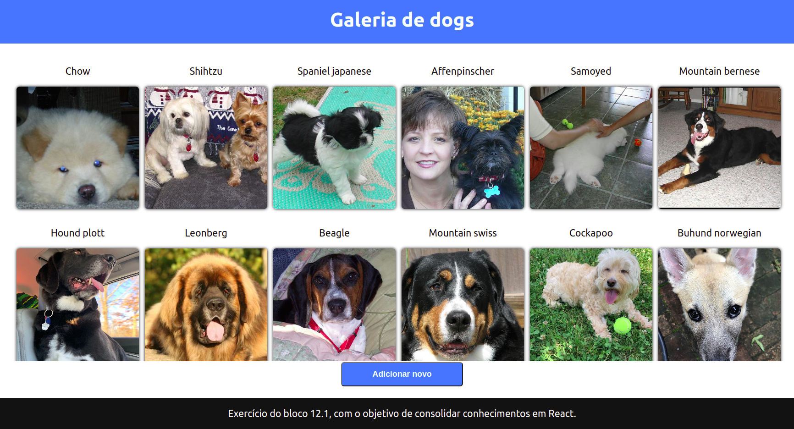

# Exercícios 12.1 - Ciclo de vida de componentes React

## O exercício foi realizado [neste repositório](https://github.com/brunofpessoa/exercise-dog-image)

O exercício propunha a utilização funcionalidades do ciclo de vida do react, como componentDidMount, para a criação de uma aplicação simples que exibe fotos de cachorros requisitadas de uma API, salvando essas informações em localStorage.

Adaptei o exercício para torná-lo mais funcional, removendo alertas de tela com a raça dos animais e adicionando-o na página.

